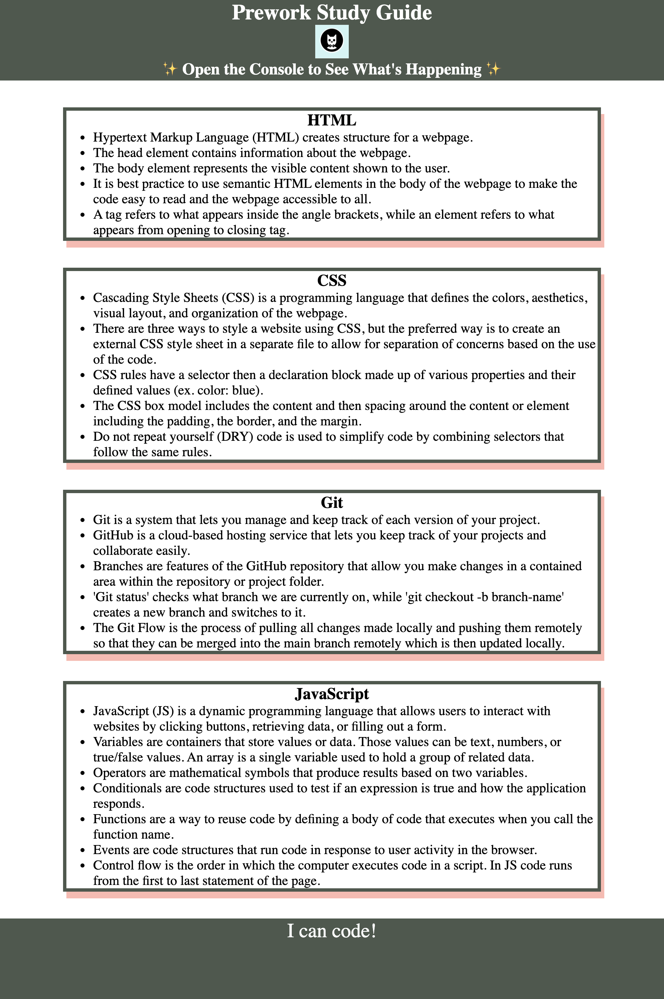

# PreWork Study Guide Webpage

## Description

This Prework Study Guide Webpage is a tool created for anyone going through a coding bootcamp to reference as needed. It includes introductory information about using HTML, CSS, Git, and JavaScript to help you build a webpage. 

## Installation

N/A

## Usage

As mentioned above this website includes notes about using HTML, CSS, Git, and JavaScript to build a webpage. If you open the DevTools console by right clicking on the webpage and navigating to 'Inspect' then 'Console' you will see the JavaScript running. In the console you will see the prework topics listed and it will even suggest a topic for you to study first. 

## Credits

N/A

## License

Please refer to the license in the repo.

## Deployed Application

[Deployed Application](https://pbullock08.github.io/prework-study-guide/)

